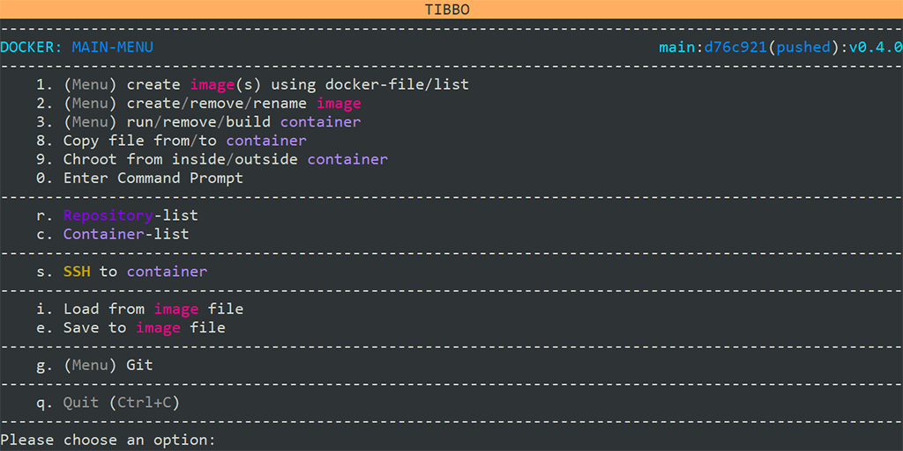
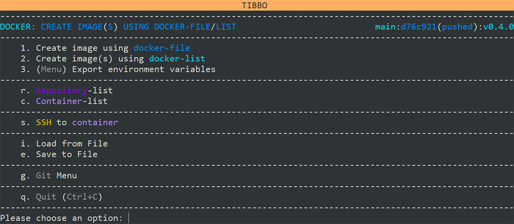

# Building Tibbo's Ubuntu-Based Distribution Images

## Introduction
This repository contains scripts and other tools used to create customized versions of Tibbo's [Ubuntu-based distribution](https://tibbo.com/store/tps/ltpp3g2/ubuntu.html) for the [Size 3 Linux Tibbo Project PCB (LTPP3), Gen. 2](https://tibbo.com/store/tps/ltpp3g2.html).

If you just want to download the latest version of our distribution in binary form to flash your device, [click here (direct download)](https://tibbo.com/downloads/open/ubuntu/ISPBOOOT.BIN).

## System Requirements 
* At least 35GB of hard drive space (50GB recommended)
* A clean installation of Ubuntu Server (latest tested version: 22.04)
  * Ubuntu Desktop is viable, but is a significantly larger download and install
  * Installation via a virtual machine is supported
    * A virtual bridge is highly recommended (not necessary if running Hyper-V)

## Getting Started
After installing Ubuntu, log in with the username you specified during the setup process.

You will need to install several packages to build images:
* Git
* Docker
* qemu-user-static

To do so, run the following commands:

``` shell
sudo apt-get update
sudo apt-get install git docker.io qemu-user-static
sudo mkdir /repo
sudo chown $USER /repo
cd /repo
git clone https://github.com/tibbotech/LTPP3_ROOTFS.git
```

<br>

***

<br>

## Building 

<br>

We have created a script designed to simplify and automate most of the process of building images. To access it, run the following commands:

``` shell
cd LTPP3_ROOTFS
sudo ./docker_mainmenu.sh
```

You will be presented with an interactive menu, as illustrated below.



Select option #1 (type `1`). This will take you to a submenu, as illustrated below.



Select option #2 (type `2`). This will provide a list of options for builds, as illustrated below.


The base build that includes the core Ubuntu components, SP7021-specific software, and Tibbo's customizations, as well as the image binary, ends in _rootfs_ispboootbin.txt_. This is the recommended choice when starting out. However, if you would like to start farther upstream, you can pick one of the earlier options.

You will be asked to confirm whether you wish to continue.
Type `y` — no need to press `Enter`. 

This will begin the process of downloading the various files needed to build images. As some of these files are very large (up to nearly 10GB), how long this process takes is highly dependent on your Internet connection, as well as your processor and storage speed.

<br>

***

<br>

## Changing build sources

This script provides the ability to customize your build with alternate sources for components. This allows you to fork the repo, meaning you can make persistent changes from the point of the fork while still retaining automated build capabilities.


From the main menu, selection option #1 (type `1`). This will take you to a submenu, as illustrated below.


Select option #3 (type `3`). This will take you to another submenu.


The first time you enter this menu, you'll need to select the docker-file with which to work. Select option #1 (type `1`) to do so.


On a fresh pull from the repo, you'll only have one option: _dockerfile_ltps_sunplus_. Select it by typing `1`.


You'll be returned to the first submenu. However, this time, you'll have additional options:
* Choose, add, or delete links to repos
* Choose, add, or delete checkout
* Choose, add, or delete link-checkout profile

<br>

***

<br>

## Getting the Binary 

After the image creation script completes successfully, the images containing the different steps of the build process are displayed. You will now be back at the image creation submenu. Type `q` to return to the main menu.


Select option #4 (type `4`). This will take you to a submenu, as illustrated below.


Type the **ID** of image you want to use. When you're just starting out, we recommend using _ltps_rootfs_ispboootbin_. 

_Hint: You can press `tab` to autocomplete._

After the container is created, a summary will show the IP address and port you can use to SSH into it.


You can also SFTP into the container (at the same IP address and port) to extract the image.

The `ISPBOOOT.bin` file used to image an LTPP3(G2) is located in `/root/SP7021/out`.

### Scripted Extraction
Alternatively, the script can also extract the file for you.


At the main menu, enter `8`, which takes you to a submenu.


You can specify whether you want to extract or insert a file. In this case, you'll want to type `1` to extract the image. 

You will be asked for the container ID, source directory and filename (usually `/root/SP7021/out/ISPBOOOT.BIN`), and destination directory.

_Hint: You can press `tab` to autocomplete._

You will be shown a summary and prompted to confirm that you want to continue. Type `y` to extract.


<br>

***

<br>

# Updating LTPP3(G2) Firmware
Now that you have a functional image for your device, it's time to flash the board. While you can use a USB flash drive for this operation, we highly recommend using a microSD card, as the faster copying speeds will vastly reduce the amount of time needed for this operation.

## Requirements
* Physical access to the device
* A power supply for the board
* A USB flash drive or microSD card
* A jumper or jump wire

If you want to monitor the progress of the operation, you will also need a USB cable with at least one Type-C connector.

## Step-by-Step Instructions
Before you begin, if the device is in an enclosure — such as a [Size 3 Linux Tibbo Project Box (LTPB3)](https://tibbo.com/store/tps/ltpb3.html) — you will need to remove the "top" cover to access the board.

If you plan on monitoring the progress of the operation, first connect your computer to the LTPP3(G2) board with the USB cable. There is a built-in serial console port (USB Type-C) behind the USB Type-A ports. Then open your preferred terminal application (e.g., [IO Ninja](https://ioninja.com)) and prepare to open the port.

1. Copy **ISPBOOOT.BIN** to the USB flash drive or microSD card.
2. Place a jumper on CN11 (perpendicular to the nearest edge of the board). This is located on the "right" side of the board next to the MD and RST buttons. If you're using a microSD card, you'll also need to jump CN10.
3. Insert the USB flash drive into the USB Type-A port **next to the HDMI port** or the microSD card into the microSD slot.
4. Power on the device.

_(Optional)_ You can now open the port on your preferred terminal application to monitor the progress of the operation.


If you're monitoring via a terminal, you'll see "ISP all: Done" (as illustrated in the image above) when the update is complete.

At this point, you should:
1. Power off the device.
2. Remove the USB flash drive or microSD card.
3. Remove the jumper(s).
4. Press the RST button to restart the device.
5. _(Optional)_ Replace the "top" cover if you're using an enclosure.

Enjoy our Ubuntu-based distribution on your LTPP3(G2).